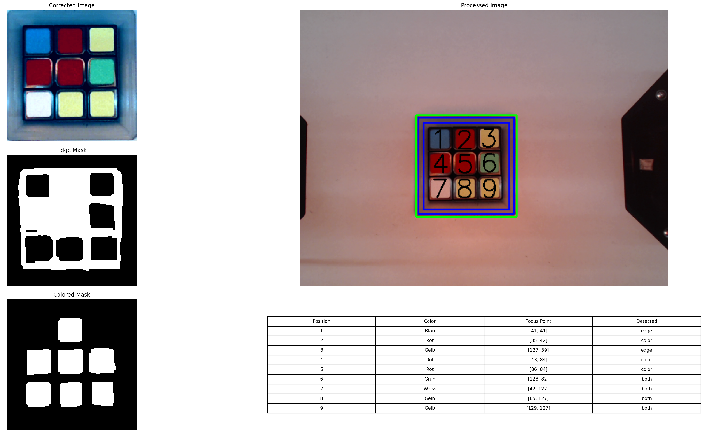

# Computer Robot Vision – Rubik's Cube Color Detection with OpenCV

This project focuses on detecting the colors of a Rubik’s Cube using OpenCV under varying lighting conditions.
The system uses multiple image-processing steps to ensure robust color recognition, even when the cube is illuminated with different colored lights.

## Project Goal

The objective is to reliably detect all 9 color segments per cube face, no matter the ambient lighting.
This is achieved by generating and combining two specialized masks:

Color Mask – applies color correction and isolates individual cube colors

Edge Mask – identifies the geometric structure of the cube and segments

The final merged mask produces a clean and stable segmentation of all cube fields.

## Approach
🔹 1. Color Mask

The color mask performs:

Color correction (to account for differently colored lighting)

Color thresholding to detect the six Rubik’s Cube colors

This mask focuses purely on color information.

🔹 2. Edge Mask

The contour mask uses:

Adaptive thresholding

Edge detection (e.g., Canny)

Contour extraction

Filtering by area and shape

This detects the square segments of the Rubik’s Cube, regardless of lighting.

🔹 3. Merging of Masks

Once both masks are generated, they are combined using bitwise operations:

The color mask ensures the correct identification of the color regions

The contour mask ensures segmentation into square fields

The result is a final merged mask that isolates each cube segment with its correctly detected color.

## Final Result

